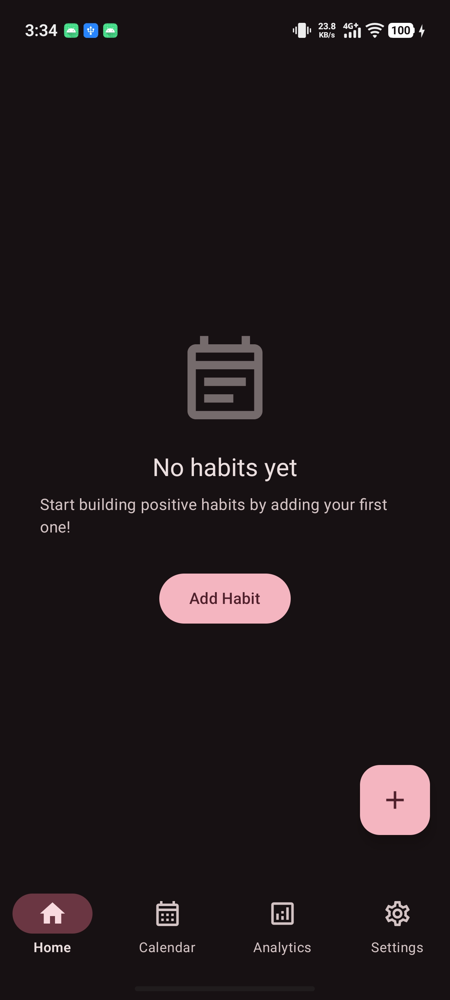
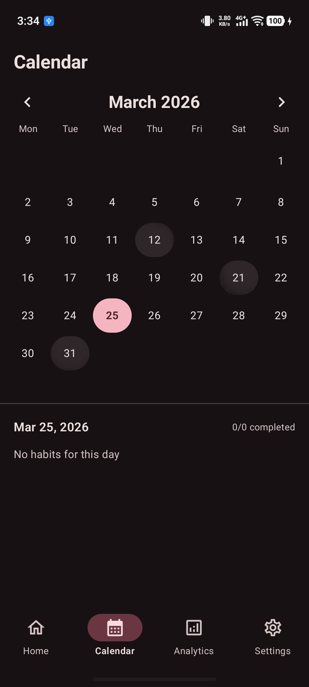
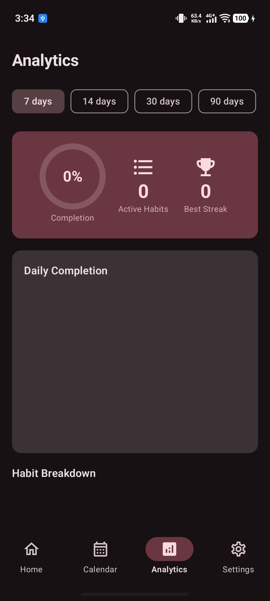
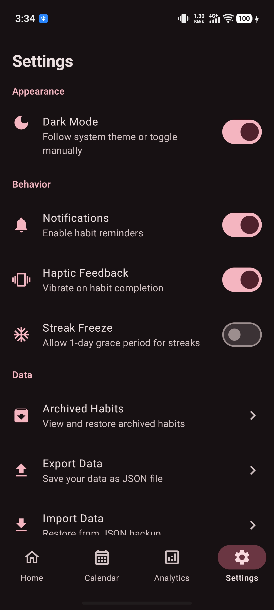
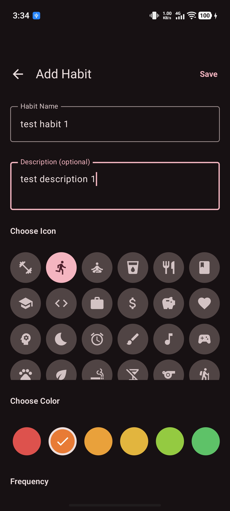
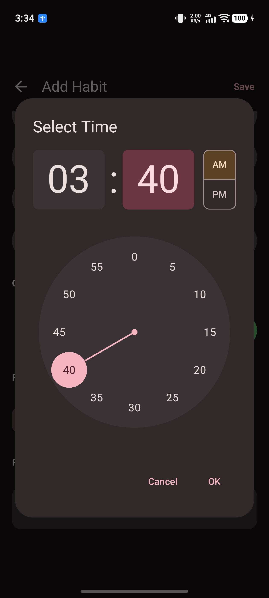
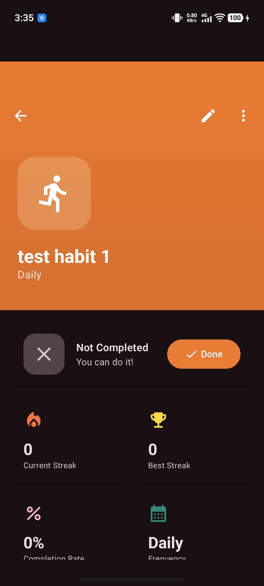
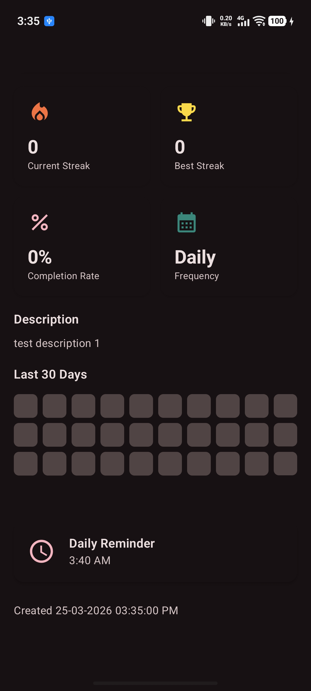
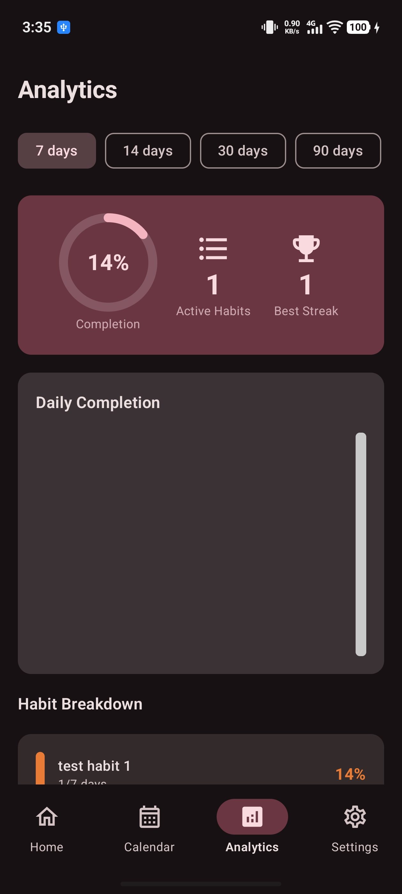
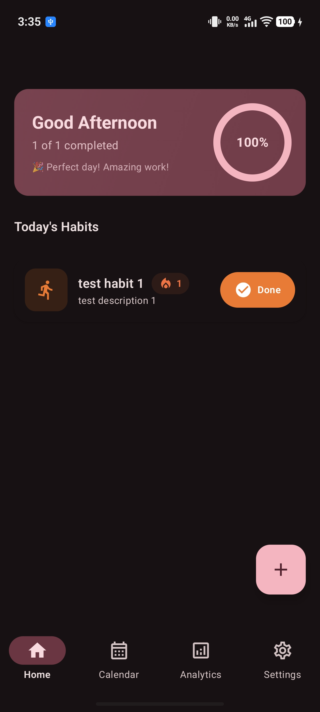

# 📱 Habit Tracker

A privacy-focused, fully offline habit tracking Android application built with modern Android development practices. Track your daily habits, monitor streaks, view analytics, and build positive routines — all without requiring an internet connection or account creation.


---

## 📖 Table of Contents

- [Features](#-features)
- [Screenshots](#-screenshots)
- [Technology Stack](#-technology-stack)
- [Architecture](#-architecture)
- [Project Structure](#-project-structure)
- [Getting Started](#-getting-started)
- [Permissions](#-permissions)
- [Reminder System](#-reminder-system)
- [User Guide](#-user-guide)
- [Troubleshooting](#-troubleshooting)
- [Contributing](#-contributing)
- [License](#-license)

---

## ✨ Features

### Core Features

| Feature                    | Description                                                                 |
| -------------------------- | --------------------------------------------------------------------------- |
| **📝 Habit Management**    | Create, edit, archive, and delete habits with customizable icons and colors |
| **✅ Daily Tracking**      | Mark habits as complete with satisfying animations and visual feedback      |
| **🔥 Streak System**       | Track current and longest streaks to stay motivated                         |
| **📅 Calendar View**       | View habit completion history on a monthly calendar with daily breakdowns   |
| **📊 Analytics Dashboard** | Visualize progress with interactive charts, completion rates, and trends    |
| **⏰ Smart Reminders**     | WorkManager-powered notifications that respect device battery optimization  |
| **🌙 Dark Mode**           | Full dark theme support with Material You dynamic colors                    |

### Privacy & Data

| Feature               | Description                                                                 |
| --------------------- | --------------------------------------------------------------------------- |
| **🔒 Fully Offline**  | All data stored locally on device using Room database, no internet required |
| **🚫 No Tracking**    | Zero analytics, no data collection, complete privacy                        |
| **📤 Export/Import**  | Backup and restore your data as JSON files for full data ownership          |
| **🗑️ Archive System** | Archive old habits without losing historical data                           |

### User Experience

| Feature                  | Description                                                           |
| ------------------------ | --------------------------------------------------------------------- |
| **🎨 Material 3 Design** | Modern UI following Material Design 3 guidelines with dynamic theming |
| **💫 Smooth Animations** | Delightful micro-interactions and transitions throughout the app      |
| **📱 Edge-to-Edge**      | Immersive full-screen experience with proper inset handling           |
| **🎯 Quick Actions**     | Complete habits directly from the home screen with one tap            |
| **⬇️ Bottom Navigation** | Easy access to Home, Calendar, Analytics, and Settings                |

### Habit Customization

- **16+ Color Options** - Personalize each habit with vibrant colors
- **24+ Icon Choices** - Choose from a variety of lifestyle and activity icons
- **Flexible Frequencies** - Daily, Weekly, Custom days, or One-time habits
- **Rich Descriptions** - Add notes and details to each habit
- **Categories** - Organize habits into custom categories

---

## 📸 Screenshots

### Home & Navigation

<p align="center">
  
  
</p>

### Habit Management

<p align="center">
  
  
  
</p>

### Calendar & Analytics

<p align="center">
  
  
  
</p>

### Settings & More

<p align="center">
  
  
</p>

---

## 🛠 Technology Stack

### Core Technologies

| Technology          | Version | Purpose                                           |
| ------------------- | ------- | ------------------------------------------------- |
| **Kotlin**          | 2.0+    | Primary programming language with modern features |
| **Jetpack Compose** | Latest  | Declarative UI toolkit for native Android         |
| **Material 3**      | Latest  | Design system with dynamic theming support        |

### Architecture Components

| Component              | Purpose                                               |
| ---------------------- | ----------------------------------------------------- |
| **MVVM Pattern**       | Separation of UI and business logic                   |
| **Clean Architecture** | Three-layer architecture (Data, Domain, Presentation) |
| **Hilt**               | Compile-time dependency injection                     |
| **Navigation Compose** | Type-safe navigation between screens                  |
| **StateFlow**          | Reactive state management in ViewModels               |

### Data & Storage

| Technology            | Purpose                                                       |
| --------------------- | ------------------------------------------------------------- |
| **Room Database**     | Local SQLite database with Flow support and migrations        |
| **DataStore**         | Proto-based preferences storage (replacing SharedPreferences) |
| **Kotlin Coroutines** | Asynchronous programming with structured concurrency          |
| **Kotlin Flow**       | Cold reactive streams for data observation                    |

### Background Processing

| Technology             | Purpose                                                |
| ---------------------- | ------------------------------------------------------ |
| **WorkManager**        | Reliable reminder scheduling with battery optimization |
| **Foreground Service** | Persistent reminder service for critical notifications |
| **Boot Receiver**      | Reschedule reminders after device restart              |

### Libraries

| Library              | Purpose                                          |
| -------------------- | ------------------------------------------------ |
| **Vico Charts**      | Beautiful, customizable bar charts for analytics |
| **KSP**              | Kotlin Symbol Processing for Room and Hilt       |
| **AndroidX Startup** | App initialization management                    |

---

## 🏗 Architecture

The app follows **Clean Architecture** principles with clear separation between layers:

```
┌──────────────────────────────────────────────────────────────────────────────┐
│                           PRESENTATION LAYER                                 │
│  ┌──────────────────┐  ┌──────────────────┐  ┌─────────────────────────────┐ │
│  │     Screens      │  │    ViewModels    │  │        Components           │ │
│  │   (Composables)  │  │   (StateFlow)    │  │     (Reusable UI)           │ │
│  │                  │  │                  │  │                             │ │
│  │ • HomeScreen     │  │ • HomeViewModel  │  │ • HabitCard                 │ │
│  │ • CalendarScreen │  │ • CalendarVM     │  │ • BottomNavigation          │ │
│  │ • AnalyticsScreen│  │ • AnalyticsVM    │  │ • ColorPicker               │ │
│  │ • DetailScreen   │  │ • DetailVM       │  │ • IconPicker                │ │
│  │ • SettingsScreen │  │ • SettingsVM     │  │ • FormComponents            │ │
│  └──────────────────┘  └──────────────────┘  └─────────────────────────────┘ │
└──────────────────────────────────────────────────────────────────────────────┘
                                    │
                                    ▼
┌──────────────────────────────────────────────────────────────────────────────┐
│                             DOMAIN LAYER                                     │
│  ┌──────────────────┐  ┌──────────────────┐  ┌─────────────────────────────┐ │
│  │     Models       │  │    Use Cases     │  │   Repository Interfaces     │ │
│  │                  │  │                  │  │                             │ │
│  │ • Habit          │  │ • CreateHabit    │  │ • HabitRepository           │ │
│  │ • HabitLog       │  │ • GetHabits      │  │ • CategoryRepository        │ │
│  │ • Category       │  │ • ToggleComplete │  │ • SettingsRepository        │ │
│  │ • Streak         │  │ • UpdateHabit    │  │                             │ │
│  │ • Settings       │  │ • DeleteHabit    │  │                             │ │
│  └──────────────────┘  └──────────────────┘  └─────────────────────────────┘ │
└──────────────────────────────────────────────────────────────────────────────┘
                                    │
                                    ▼
┌──────────────────────────────────────────────────────────────────────────────┐
│                              DATA LAYER                                      │
│  ┌──────────────────┐  ┌──────────────────┐  ┌─────────────────────────────┐ │
│  │    Room DAOs     │  │   Repositories   │  │         Entities            │ │
│  │                  │  │ (Implementations)│  │                             │ │
│  │ • HabitDao       │  │                  │  │ • HabitEntity               │ │
│  │ • HabitLogDao    │  │ • HabitRepoImpl  │  │ • HabitLogEntity            │ │
│  │ • CategoryDao    │  │ • CategoryImpl   │  │ • CategoryEntity            │ │
│  │ • SettingsDao    │  │ • SettingsImpl   │  │ • SettingsEntity            │ │
│  │ • StreakDao      │  │                  │  │ • StreakEntity              │ │
│  └──────────────────┘  └──────────────────┘  └─────────────────────────────┘ │
└──────────────────────────────────────────────────────────────────────────────┘
```

### Data Flow

```
┌─────────────┐     ┌───────────┐     ┌──────────┐     ┌───────────┐     ┌──────────┐
│   User      │────▶│  Screen   │────▶│ ViewModel│────▶│  UseCase  │────▶│Repository│
│  Action     │     │(Composable)│    │(StateFlow)│    │ (Business)│     │  (Impl)  │
└─────────────┘     └───────────┘     └──────────┘     └───────────┘     └──────────┘
                          ▲                                                    │
                          │                                                    ▼
                    ┌─────┴─────┐                                        ┌──────────┐
                    │  UI State │◀───────────── Flow<T> ────────────────│   Room   │
                    │  Update   │                                        │ Database │
                    └───────────┘                                        └──────────┘
```

---

## 📁 Project Structure

```
app/src/main/java/com/nakibul/hassan/habittracker/
│
├── 📂 data/                              # DATA LAYER
│   ├── 📂 local/
│   │   ├── 📂 dao/                       # Database Access Objects
│   │   │   ├── CategoryDao.kt            # Category CRUD operations
│   │   │   ├── HabitDao.kt               # Habit CRUD operations
│   │   │   ├── HabitLogDao.kt            # Completion log operations
│   │   │   ├── SettingsDao.kt            # App settings operations
│   │   │   └── StreakDao.kt              # Streak tracking operations
│   │   │
│   │   ├── 📂 entity/                    # Room Entity Classes
│   │   │   ├── CategoryEntity.kt         # Category table definition
│   │   │   ├── HabitEntity.kt            # Habit table definition
│   │   │   ├── HabitLogEntity.kt         # Log table definition
│   │   │   ├── SettingsEntity.kt         # Settings table definition
│   │   │   └── StreakEntity.kt           # Streak table definition
│   │   │
│   │   └── HabitDatabase.kt              # Room Database configuration
│   │
│   └── 📂 repository/                    # Repository Implementations
│       ├── CategoryRepositoryImpl.kt     # Category data operations
│       ├── HabitRepositoryImpl.kt        # Habit data operations
│       └── SettingsRepositoryImpl.kt     # Settings data operations
│
├── 📂 di/                                # DEPENDENCY INJECTION
│   ├── AppModule.kt                      # Application-level dependencies
│   ├── DatabaseModule.kt                 # Database-related dependencies
│   └── RepositoryModule.kt               # Repository bindings
│
├── 📂 domain/                            # DOMAIN LAYER
│   ├── 📂 model/                         # Domain Models (DTOs)
│   │   ├── Category.kt                   # Category business model
│   │   ├── Habit.kt                      # Habit business model
│   │   ├── HabitLog.kt                   # Log business model
│   │   ├── Settings.kt                   # Settings business model
│   │   └── Streak.kt                     # Streak business model
│   │
│   ├── 📂 repository/                    # Repository Contracts
│   │   ├── CategoryRepository.kt         # Category repository interface
│   │   ├── HabitRepository.kt            # Habit repository interface
│   │   └── SettingsRepository.kt         # Settings repository interface
│   │
│   └── 📂 usecase/                       # Business Use Cases
│       ├── CreateHabitUseCase.kt         # Create new habit
│       ├── GetHabitsUseCase.kt           # Retrieve habits
│       ├── UpdateHabitUseCase.kt         # Update existing habit
│       ├── DeleteHabitUseCase.kt         # Delete habit
│       ├── ToggleHabitCompletionUseCase.kt # Mark habit complete/incomplete
│       ├── GetHabitByIdUseCase.kt        # Get single habit
│       └── ...                           # Additional use cases
│
├── 📂 presentation/                      # PRESENTATION LAYER
│   ├── 📂 components/                    # Reusable UI Components
│   │   ├── BottomNavigation.kt           # Bottom navigation bar
│   │   ├── FormComponents.kt             # Form input components
│   │   ├── HabitComponents.kt            # Habit card & related UI
│   │   ├── CalendarComponents.kt         # Calendar UI components
│   │   └── ChartComponents.kt            # Analytics chart components
│   │
│   ├── 📂 navigation/                    # Navigation Configuration
│   │   ├── AppNavHost.kt                 # Navigation graph setup
│   │   └── NavRoutes.kt                  # Route definitions
│   │
│   └── 📂 ui/                            # Screen Implementations
│       ├── 📂 home/                      # Home screen
│       │   ├── HomeScreen.kt             # UI composable
│       │   └── HomeViewModel.kt          # State management
│       ├── 📂 calendar/                  # Calendar screen
│       │   ├── CalendarScreen.kt
│       │   └── CalendarViewModel.kt
│       ├── 📂 analytics/                 # Analytics screen
│       │   ├── AnalyticsScreen.kt
│       │   └── AnalyticsViewModel.kt
│       ├── 📂 settings/                  # Settings screen
│       │   ├── SettingsScreen.kt
│       │   └── SettingsViewModel.kt
│       ├── 📂 detail/                    # Habit detail screen
│       │   ├── HabitDetailScreen.kt
│       │   └── HabitDetailViewModel.kt
│       ├── 📂 addhabit/                  # Add habit screen
│       │   ├── AddHabitScreen.kt
│       │   └── AddHabitViewModel.kt
│       ├── 📂 edithabit/                 # Edit habit screen
│       │   ├── EditHabitScreen.kt
│       │   └── EditHabitViewModel.kt
│       ├── 📂 archived/                  # Archived habits screen
│       │   ├── ArchivedScreen.kt
│       │   └── ArchivedViewModel.kt
│       └── MainActivity.kt               # Main activity entry point
│
├── 📂 notification/                      # NOTIFICATION SYSTEM
│   ├── NotificationHelper.kt             # Notification facade
│   ├── ReminderScheduler.kt              # WorkManager scheduler
│   ├── ReminderWorker.kt                 # Background worker for reminders
│   ├── HabitReminderService.kt           # Foreground service
│   ├── BootReceiver.kt                   # Boot completed receiver
│   └── AlarmReceiver.kt                  # Alarm broadcast receiver
│
├── 📂 shared/                            # SHARED UTILITIES
│   ├── 📂 constant/                      # App Constants
│   │   ├── HabitColors.kt                # Predefined color palette
│   │   ├── HabitIcons.kt                 # Available icon set
│   │   └── SettingsKeys.kt               # Settings key constants
│   │
│   └── 📂 utils/                         # Utility Functions
│       └── DateUtils.kt                  # Date formatting helpers
│
├── 📂 ui/                                # THEMING
│   └── 📂 theme/
│       ├── Color.kt                      # Color definitions
│       ├── Theme.kt                      # Material theme setup
│       └── Type.kt                       # Typography definitions
│
└── HabitTrackerApp.kt                    # Application class (Hilt entry point)
```

---

## 🚀 Getting Started

### Prerequisites

| Requirement    | Minimum Version             |
| -------------- | --------------------------- |
| Android Studio | Ladybug (2024.2.1) or later |
| JDK            | 11 or higher                |
| Android SDK    | 36 (Android 15)             |
| Minimum SDK    | 29 (Android 10)             |
| Gradle         | 8.0+                        |

### Installation

1. **Clone the repository**

   ```bash
   git clone https://github.com/yourusername/habit-tracker.git
   cd habit-tracker
   ```

2. **Open in Android Studio**
   - Open Android Studio
   - Select "Open an existing project"
   - Navigate to the cloned directory
   - Wait for Gradle sync to complete

3. **Build the project**

   ```bash
   # On Windows
   .\gradlew assembleDebug

   # On macOS/Linux
   ./gradlew assembleDebug
   ```

4. **Run on device/emulator**
   - Connect an Android device (USB debugging enabled) or start an emulator
   - Click "Run" button or press `Shift + F10`
   - Select target device

### Build Variants

| Variant   | Description                                           | Use Case              |
| --------- | ----------------------------------------------------- | --------------------- |
| `debug`   | Development build with debugging enabled, no ProGuard | Development & testing |
| `release` | Production build with ProGuard minification           | Distribution          |

### Debug Build

```bash
.\gradlew assembleDebug
# APK location: app/build/outputs/apk/debug/app-debug.apk
```

### Release Build

```bash
.\gradlew assembleRelease
# Note: Requires signing configuration in build.gradle.kts
```

---

## 🔐 Permissions

The app requires the following permissions:

| Permission               | Purpose                                   | Required |
| ------------------------ | ----------------------------------------- | -------- |
| `POST_NOTIFICATIONS`     | Show reminder notifications (Android 13+) | Runtime  |
| `SCHEDULE_EXACT_ALARM`   | Schedule precise reminder times           | Yes      |
| `USE_EXACT_ALARM`        | Use exact alarm scheduling                | Yes      |
| `RECEIVE_BOOT_COMPLETED` | Reschedule reminders after device restart | Yes      |
| `VIBRATE`                | Vibration for notifications               | Yes      |
| `WAKE_LOCK`              | Keep device awake for alarms              | Yes      |
| `FOREGROUND_SERVICE`     | Run reminder service                      | Yes      |

### Runtime Permission Handling

On Android 13 and above, the app automatically requests notification permission when launched:

```kotlin
// Handled in MainActivity.kt
if (Build.VERSION.SDK_INT >= Build.VERSION_CODES.TIRAMISU) {
    if (!hasNotificationPermission) {
        requestPermissionLauncher.launch(Manifest.permission.POST_NOTIFICATIONS)
    }
}
```

---

## ⏰ Reminder System

### Architecture

The reminder system uses **WorkManager** for reliable, battery-efficient scheduling:

```
┌─────────────────┐     ┌─────────────────┐     ┌─────────────────┐
│  AddHabitVM /   │────▶│ Notification    │────▶│ Reminder        │
│  EditHabitVM    │     │ Helper          │     │ Scheduler       │
└─────────────────┘     └─────────────────┘     └─────────────────┘
                                                        │
                                                        ▼
┌─────────────────┐     ┌─────────────────┐     ┌─────────────────┐
│ Notification    │◀────│ Reminder        │◀────│ WorkManager     │
│ (System)        │     │ Worker          │     │ (Periodic)      │
└─────────────────┘     └─────────────────┘     └─────────────────┘
```

### How It Works

1. **Scheduling**: When a habit with a reminder time is created/updated, `NotificationHelper` delegates to `ReminderScheduler`
2. **WorkManager**: Creates a `PeriodicWorkRequest` with the calculated initial delay
3. **ReminderWorker**: Executes at the scheduled time, checks if notification should show
4. **Smart Filtering**: Worker checks:
   - Is the habit archived?
   - Is today a valid day for this habit's frequency?
   - Has the habit already been completed today?
5. **Notification**: Shows high-priority notification with sound and vibration

### Frequency Support

| Frequency | Scheduling     | Behavior                         |
| --------- | -------------- | -------------------------------- |
| Daily     | Every 24 hours | Reminder every day at set time   |
| Weekly    | Every 7 days   | Reminder once per week           |
| Custom    | Every 24 hours | Worker filters by selected days  |
| Once      | Not scheduled  | No reminders for one-time habits |

### Boot Persistence

Reminders are automatically rescheduled after device restart via `BootReceiver`:

```kotlin
@AndroidEntryPoint
class BootReceiver : BroadcastReceiver() {
    override fun onReceive(context: Context, intent: Intent) {
        if (intent.action == Intent.ACTION_BOOT_COMPLETED) {
            // Reschedule all habit reminders
            reminderScheduler.rescheduleAllReminders(habits)
        }
    }
}
```

### Debugging Reminders

Use Logcat with the following tags:

```bash
adb logcat -s AddHabitViewModel:D EditHabitViewModel:D NotificationHelper:D ReminderScheduler:D ReminderWorker:D BootReceiver:D
```

---

## 📚 User Guide

### Creating a Habit

1. Tap the **+** floating action button on the Home screen
2. Enter the habit name (required)
3. Optionally add a description
4. Select an icon from the scrollable icon picker
5. Choose a color for the habit from the scrollable color palette
6. Set the frequency:
   - **Daily**: Every day
   - **Weekly**: Once per week
   - **Custom**: Select specific days of the week
   - **Once**: One-time habit
7. Optionally set a daily reminder time using the time picker
8. Tap **Save**

### Tracking Habits

- On the Home screen, tap the **"Complete"** button to mark a habit as done
- Completed habits show a checkmark with completion status
- Your daily progress percentage updates in real-time
- Streaks automatically increment for consecutive completion days

### Viewing Habit Details

1. Tap on any habit card to open the detail screen
2. View comprehensive information:
   - **Streak Cards**: Current streak and longest streak
   - **30-Day Grid**: Visual completion history
   - **Creation Date**: When the habit was created
   - **Reminder Time**: Scheduled notification time
   - **Complete Button**: Mark today as complete

### Calendar View

- Navigate to the **Calendar** tab via bottom navigation
- Swipe left/right or tap arrows to change months
- Each day shows completion indicators
- Tap any date to see habits scheduled/completed for that day

### Analytics Dashboard

- Navigate to the **Analytics** tab
- View overall completion rate as a percentage
- See bar charts showing individual habit performance
- Track your best streaks and completion trends
- Filter by time period (Week, Month, All Time)

### Managing Habits

#### Edit a Habit

1. Tap on a habit card to open details
2. Tap the **Edit** icon (pencil) in the top app bar
3. Modify any fields
4. Tap **Save** to apply changes

#### Archive a Habit

1. Open the habit detail screen
2. Tap the **three-dot menu**
3. Select **Archive**
4. Habit moves to archived list (accessible from Settings)

#### Restore Archived Habit

1. Go to **Settings → Archived Habits**
2. Find the habit to restore
3. Tap **Restore** button

#### Delete a Habit

1. Open the habit detail screen
2. Tap the **three-dot menu**
3. Select **Delete**
4. Confirm deletion (⚠️ this action is permanent)

### Settings

| Setting             | Description                      |
| ------------------- | -------------------------------- |
| **Dark Mode**       | Toggle dark/light theme          |
| **Export Data**     | Save all data to JSON file       |
| **Import Data**     | Restore data from JSON file      |
| **Archived Habits** | View and restore archived habits |
| **About**           | App version and information      |

---

## 🔧 Troubleshooting

### Notifications Not Showing

1. **Check Permission**: Go to Android Settings → Apps → Habit Tracker → Notifications → Enable
2. **Battery Optimization**: Disable battery optimization for the app
3. **Check Reminder Time**: Ensure a reminder time is set for the habit
4. **Verify Logs**: Use Logcat to debug (see Debugging Reminders section)

### Data Not Saving

1. **Storage Permission**: Ensure app has storage access for export/import
2. **Database Error**: Clear app data and restart (Settings → Apps → Habit Tracker → Clear Data)

### App Crashing

1. **Update Dependencies**: Run `.\gradlew build --refresh-dependencies`
2. **Clean Build**: Run `.\gradlew clean assembleDebug`
3. **Check Logcat**: Look for crash stack traces

### Build Errors

1. **Gradle Sync**: File → Sync Project with Gradle Files
2. **Invalidate Caches**: File → Invalidate Caches and Restart
3. **Update Gradle**: Ensure Gradle wrapper is up to date

---

## 🤝 Contributing

Contributions are welcome! Please follow these steps:

1. **Fork** the repository
2. **Create** a feature branch
   ```bash
   git checkout -b feature/amazing-feature
   ```
3. **Commit** your changes
   ```bash
   git commit -m 'Add amazing feature'
   ```
4. **Push** to the branch
   ```bash
   git push origin feature/amazing-feature
   ```
5. **Open** a Pull Request

### Code Style Guidelines

- Follow [Kotlin coding conventions](https://kotlinlang.org/docs/coding-conventions.html)
- Use meaningful variable and function names
- Add KDoc comments for public functions and classes
- Write unit tests for new features
- Ensure no lint warnings before submitting

### Commit Message Format

```
type(scope): description

[optional body]

[optional footer]
```

Types: `feat`, `fix`, `docs`, `style`, `refactor`, `test`, `chore`

---

## 📄 License

This project is licensed under the MIT License - see the [LICENSE](LICENSE) file for details.

```
MIT License

Copyright (c) 2024 Nakibul Hassan

Permission is hereby granted, free of charge, to any person obtaining a copy
of this software and associated documentation files (the "Software"), to deal
in the Software without restriction, including without limitation the rights
to use, copy, modify, merge, publish, distribute, sublicense, and/or sell
copies of the Software, and to permit persons to whom the Software is
furnished to do so, subject to the following conditions:

The above copyright notice and this permission notice shall be included in all
copies or substantial portions of the Software.

THE SOFTWARE IS PROVIDED "AS IS", WITHOUT WARRANTY OF ANY KIND, EXPRESS OR
IMPLIED, INCLUDING BUT NOT LIMITED TO THE WARRANTIES OF MERCHANTABILITY,
FITNESS FOR A PARTICULAR PURPOSE AND NONINFRINGEMENT. IN NO EVENT SHALL THE
AUTHORS OR COPYRIGHT HOLDERS BE LIABLE FOR ANY CLAIM, DAMAGES OR OTHER
LIABILITY, WHETHER IN AN ACTION OF CONTRACT, TORT OR OTHERWISE, ARISING FROM,
OUT OF OR IN CONNECTION WITH THE SOFTWARE OR THE USE OR OTHER DEALINGS IN THE
SOFTWARE.
```

---

## 🙏 Acknowledgments

- [Material Design 3](https://m3.material.io/) - Design system guidelines
- [Jetpack Compose](https://developer.android.com/jetpack/compose) - Modern UI toolkit
- [Vico](https://github.com/patrykandpatrick/vico) - Chart library for analytics
- [Hilt](https://dagger.dev/hilt/) - Dependency injection framework
- [Room](https://developer.android.com/training/data-storage/room) - Local database
- [WorkManager](https://developer.android.com/topic/libraries/architecture/workmanager) - Background processing

---

## 📞 Contact

**Nakibul Hassan**

- Email: nakibhasan2711@gmail.com

---

<p align="center">
  Made with ❤️ using Kotlin & Jetpack Compose
</p>

<p align="center">
  <b>Package:</b> <code>com.nakibul.hassan.habittracker</code>
</p>
